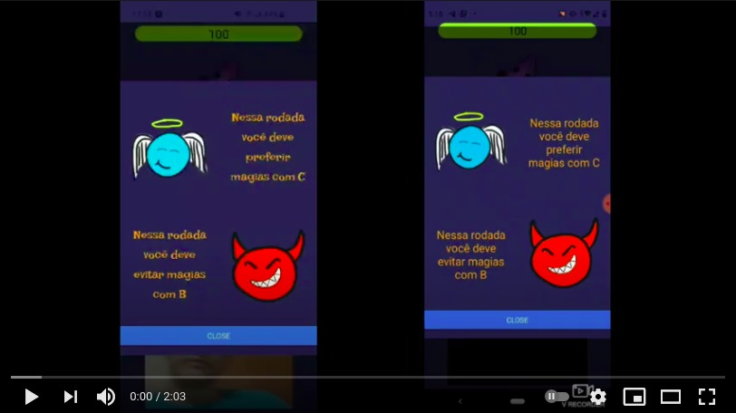
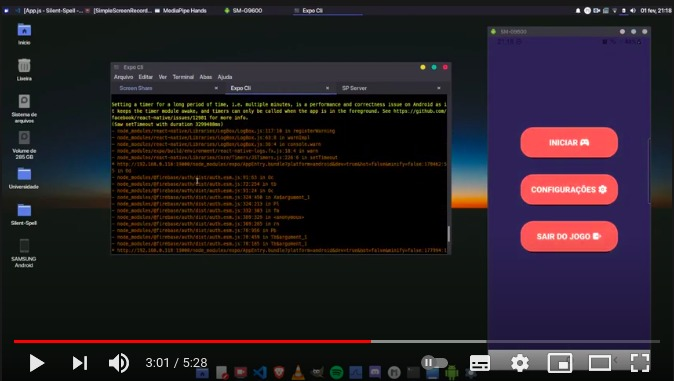

# Silent Spell
 Repositório oficial do jogo Silent Spell
## Desenvolvedores: 
 Romildo Juliano
 
 José Douglas
 
 João Victor

## Instalação
No terminal, digite:
```
git clone https://github.com/romildojuliano/Silent-Spell.git

cd Silent-Spell
```
Na mesma pasta, instale os dependências com o comando npm install

### Dependencias do servidor
``` 
pip install flask-socketio
pip install -U eventlet
pip install fastai
pip install websockets
```

## Como rodar?
altere os ips nos arquivos src/screens/TrackHandsScreen.js e src/screens/Combat.js para o ip de onde você está rodando seu servidor.

no terminal caminhe para a pasta 'Servidor/' e execute o seguinte comando

```python app.py```
em outro terminal caminhe até a pasta 'Servidor/' e execute o seguinte comando:

```python server.py```

em outro terminal digite 'expo start' dentro da pasta e escaneie o QR code usando o aplicativo expo no seu celular.

# Pequena demonstração do multiplayer
[](https://www.youtube.com/watch?v=UGJroL4UolU)

# Pequena demonstração do singleplayer
[](https://youtu.be/ck3u7Mt3UNQ)

# Video explicando um pouco sobre o funcionamento do projeto
[](https://youtu.be/FFpZURugays?t=181)


